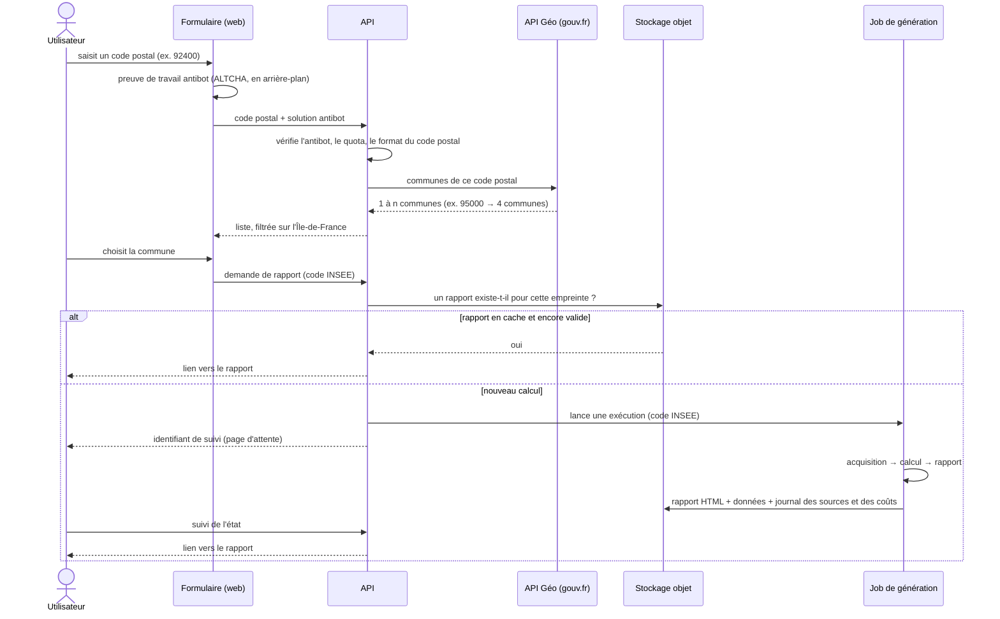
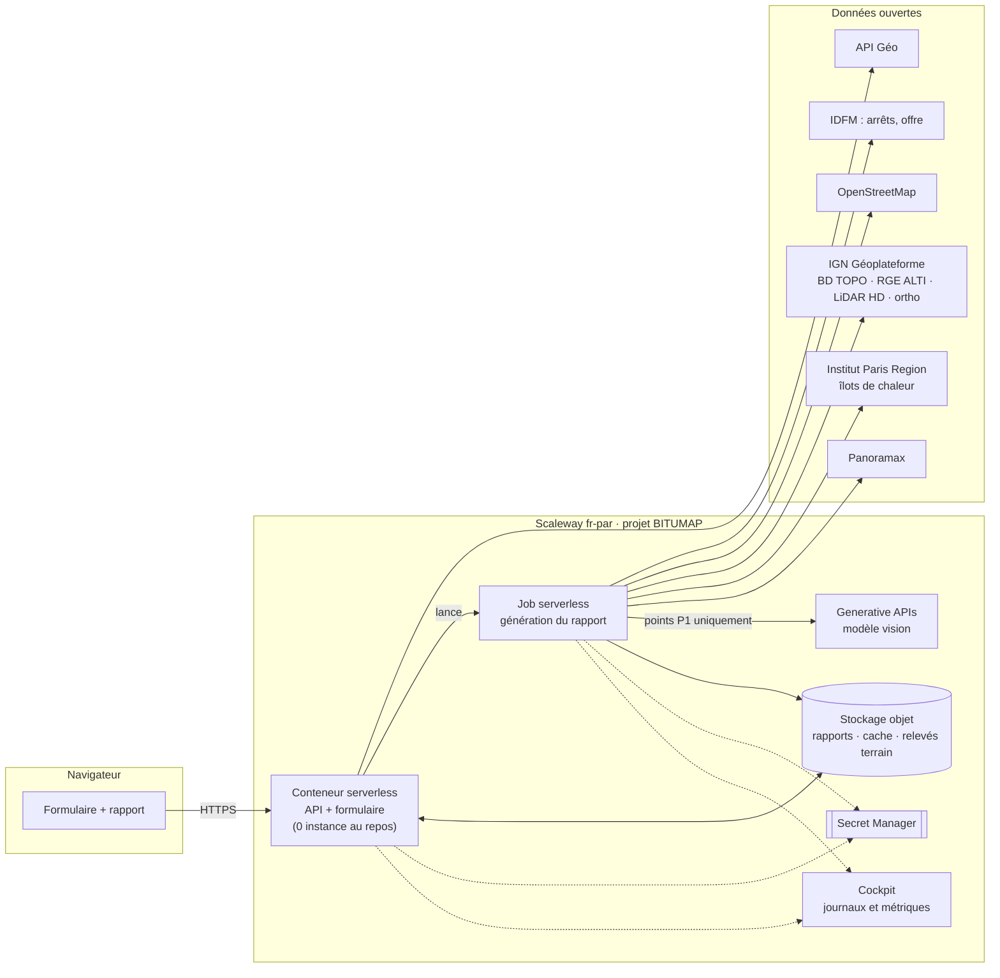

# bitumap

**Diagnostic à la demande du risque d'orniérage des enrobés sur le réseau bus, en Île-de-France.**

On saisit un code postal, on choisit la commune, et bitumap génère un rapport complet. Le
rapport classe les arrêts de bus, les carrefours à feux et les giratoires selon la
sollicitation de la chaussée, en s'appuyant uniquement sur des données ouvertes. C'est un
**premier tri de bureau** : il indique où aller relever en priorité sur le terrain, mais il
**ne mesure pas l'état réel de la chaussée**. Les relevés terrain (annotations, photos)
viennent ensuite enrichir le rapport.

> **État** : le socle de sécurité CI est en place (fonctionnalité 001). La génération du
> rapport (002) est en cours de spécification. Ce document décrit l'**architecture cible** :
> chaque choix y sera confirmé ou révisé par le plan de la fonctionnalité qui l'implémente
> (`specs/NNN-*/plan.md`), et les versions exactes sont figées dans les fichiers de
> dépendances.
>
> Prototype de référence : [`docs/reference/prototype-courbevoie-v2.html`](docs/reference/prototype-courbevoie-v2.html)
> (Courbevoie, 27 septembre 2026).

---

## Sommaire

1. [Principes](#principes)
2. [Parcours d'une demande](#parcours-dune-demande)
3. [Architecture](#architecture)
4. [Modules](#modules)
5. [Méthode de score](#méthode-de-score)
6. [Stack technique](#stack-technique)
7. [Stockage](#stockage)
8. [Sécurité](#sécurité)
9. [Développement](#développement)
10. [Feuille de route](#feuille-de-route)

---

## Principes

La [constitution](.specify/memory/constitution.md) fait foi. En résumé :

| # | Principe | Effet sur l'architecture |
|---|---|---|
| I | **Sécurité d'abord** | contrôles bloquants sur chaque PR, antibot, quotas, moindre privilège |
| II | **À la demande, zéro coût au repos** | uniquement du serverless qui revient à zéro, rapports mis en cache |
| III | **Souveraineté** | Scaleway `fr-par`, données ouvertes françaises, LLM hébergé en France |
| IV | **Méthode reproductible** | score déterministe et versionné ; mêmes entrées ⇒ même rapport |
| V | **IA encadrée** | LLM vision limité aux points P1, résultat « à confirmer », coût plafonné |
| VI | **Extensible par le terrain** | relevés rattachés à des points stables, couche distincte « constaté » |
| VII | **Simplicité et tests** | pipeline en 3 étapes, adaptateurs testés sur des données figées |
| VIII | **Retour d'expérience** | [`LESSON-LEARNED.md`](LESSON-LEARNED.md) |
| IX | **Agents IA : proposer, jamais fusionner** | branches dédiées, fusion humaine |

---

## Parcours d'une demande



**Règles du formulaire**

- Code postal : 5 chiffres, dans un département d'Île-de-France (75, 77, 78, 91, 92, 93,
  94, 95), et existant selon l'[API Géo](https://geo.api.gouv.fr).
- Un code postal peut couvrir **plusieurs communes** : l'utilisateur en choisit une.
  L'échelle du département sera proposée ensuite, derrière un quota plus strict.
- Antibot **ALTCHA** : preuve de travail calculée par le navigateur, auto-hébergée, sans
  cookie ni tiers (RGPD), accessible (WCAG 2.2 AA). Complétée par une limite de débit par
  adresse IP et un quota de générations par jour, pour éviter qu'un abus ne fasse exploser
  la facture.

**Empreinte d'un rapport** = code INSEE + version de la méthode + empreinte des sources
(date d'extraction de chaque jeu). Même empreinte ⇒ le rapport en cache est renvoyé sans
rien recalculer (principes II et IV).

---

## Architecture



| Composant | Service Scaleway | Pourquoi |
|---|---|---|
| API et formulaire | **Serverless Containers** | revient à 0 instance au repos ; démarre à la requête |
| Génération | **Serverless Jobs** | traitement long (plusieurs minutes pour une commune), facturé à l'exécution |
| Rapports, cache, photos des relevés | **Object Storage** (compatible S3) | fichiers immuables ou volumineux, facturés au stockage (principe II) |
| Secrets | **Secret Manager** | clé antibot, clés d'API ; jamais dans le code |
| LLM vision | **Generative APIs** | hébergé en France, API compatible OpenAI |
| Observabilité | **Cockpit** | journaux, métriques, alertes de coût |
| Infrastructure | **OpenTofu** | tout est décrit en code ; amorçage : [`infra/bootstrap/`](infra/bootstrap/README.md) |

Les métadonnées (comptes, demandes et lots de génération, relevés terrain et leurs versions,
état des photos) sont dans une base **Serverless SQL** qui revient à zéro au repos : les
fichiers JSON initialement prévus ne permettaient ni quotas atomiques, ni envoi idempotent
depuis un téléphone (principe VII : besoin mesuré).

---

## Modules

Code applicatif Python, en un seul paquet `bitumap`. Le pipeline suit trois étapes
indépendantes qui se passent des fichiers intermédiaires versionnés.

```text
src/bitumap/
├── territoire/        # code postal → communes (API Géo), périmètre IDF, emprise
├── sources/           # un adaptateur par source (acquisition + normalisation)
│   ├── idfm.py        #   arrêts, lignes, passages par jour et en pointe
│   ├── osm.py         #   feux, giratoires, revêtement, itinéraires bus
│   ├── bdtopo.py      #   tronçons de route, type de voie, bâtiments et hauteurs
│   ├── relief.py      #   RGE ALTI : pentes
│   ├── lidar.py       #   LiDAR HD (MNS) : obstacles au soleil (bâti et végétation)
│   ├── chaleur.py     #   Institut Paris Region : îlots de chaleur
│   ├── ortho.py       #   orthophotos historiques (âge de l'enrobé)
│   └── panoramax.py   #   photos de rue récentes
├── points/            # construction des points : arrêts, carrefours à feux, giratoires
├── facteurs/          # un module par facteur, testé isolément
│   ├── charge.py      #   bus/jour (échelle log), pointe
│   ├── sollicitation.py
│   ├── site.py        #   pente, revêtement, ouvrage d'art
│   ├── voirie.py      #   type de route et gestionnaire (nouveau)
│   ├── ensoleillement.py
│   ├── chaleur.py
│   └── age_enrobe.py  #   LLM vision, points P1 uniquement, « à confirmer »
├── score/             # combinaison déterministe, versionnée ; priorités P1/P2/P3
├── rapport/           # rendu HTML (carte, liste, fiches, méthode, sources, limites)
├── terrain/           # relevés : saisie, versions, photos, export, modération (feature 003)
├── stockage/          # accès objet : cache, rapports, relevés
├── api/               # formulaire, antibot, quotas, lancement et suivi des jobs
└── job/               # point d'entrée de la génération (étapes 1 → 3)

infra/                 # OpenTofu (+ amorçage)
tests/                 # unitaires, adaptateurs sur données figées, non-régression Courbevoie
```

### Étape 1 — Acquisition (`sources/`)

Chaque adaptateur télécharge sa source sur l'emprise de la commune, la normalise et
l'écrit dans le cache avec **licence, URL et date d'extraction** (principe III). Les
extractions sont réutilisées tant qu'elles sont à jour.

### Étape 2 — Calcul (`points/`, `facteurs/`, `score/`)

Un facteur = une fonction pure `point → valeur + explication`. Le score combine les
facteurs selon la **version de méthode** en vigueur. Le seul appel non déterministe (LLM
vision) est isolé dans `age_enrobe.py`, **mis en cache** et borné par la méthode.

### Étape 3 — Rapport (`rapport/`)

HTML autonome dans l'esprit du prototype : carte, filtres par priorité et par type de
point, fiche détaillée par point, méthode, sources et limites. Chaque point a un
**identifiant stable**, auquel se rattacheront les relevés terrain. Un export PDF est
envisagé.

---

## Méthode de score

Méthode de départ : celle du prototype (charge × sollicitation × site × chaleur × âge de
l'enrobé). Évolutions prévues, chacune avec une **nouvelle version de méthode** et une
entrée dans le journal des changements de méthode :

| Sujet | Prototype | Cible |
|---|---|---|
| **Type de route** | absent | **nouveau facteur** : classement administratif (nationale, départementale, communale, voie privée…) issu de la BD TOPO, recoupé avec la référence OSM (`D 7`, `N 13`…). Il sert aussi à désigner le **gestionnaire** de la voie (département ou commune), donc le destinataire du rapport |
| **Ensoleillement** | heures de soleil à la mi-juillet, ombres des bâtiments (BD TOPO) et des arbres (infrarouge) : **défauts constatés** | calcul d'ombre sur le **modèle numérique de surface LiDAR HD** (bâti et végétation réels, résolution métrique), position du soleil calculée heure par heure sur la période chaude, **échantillonnage sur la zone de roulement** plutôt qu'en un point, prise en compte de l'orientation de la rue ; validation sur des points dont l'ensoleillement est connu |
| **Îlots de chaleur** | aléa de jour de l'Institut Paris Region (0–16) : **à approfondir** | à instruire dans le plan : croiser l'aléa IPR (édition 2022) avec la **température de surface** issue de l'imagerie satellite thermique, **mise à jour chaque été**, avec le contexte urbain (zones climatiques locales), la **minéralisation autour du point** (surface nue, sans végétation, mesurée sur l'orthophoto infrarouge récente) et la **chaleur rejetée par les climatiseurs**, dont le parc évolue vite (indicateur à trouver : diagnostics de performance énergétique de l'ADEME, usage des bâtiments), ainsi que l'**exposition aux canicules de l'année** ; puis mesurer ce que chaque indicateur apporte à la prédiction de l'orniérage avant de l'intégrer |
| Âge de l'enrobé | lecture manuelle des orthophotos | LLM vision sur les points P1, marqué « à confirmer », coût plafonné |

Le score **classe** des points à relever en priorité ; il ne mesure pas l'état de la
chaussée. Le cas Courbevoie sert de test de non-régression : tout écart de rang doit être
expliqué par un changement de méthode ou de source.

---

## Stack technique

| Domaine | Choix | Raison |
|---|---|---|
| Langage | **Python 3.14** | écosystème géospatial ; même langage pour l'API et le job |
| Dépendances | **uv** (verrouillage `uv.lock`) | installations reproductibles et rapides |
| Qualité | **Ruff** (lint et format), **pytest** | un seul outil de style ; tests sur données figées |
| Géospatial | **GeoPandas**, **Shapely**, **pyproj** (Lambert 93), **Rasterio** | vecteurs, projections, rasters (relief, LiDAR, ortho) |
| Soleil | **pvlib** (position du soleil) + calcul d'ombre sur raster | ensoleillement heure par heure |
| OSM | extrait **Geofabrik Île-de-France** + osmium | pas de dépendance à une API tierce saturable |
| API web | **FastAPI** + Pydantic | validation stricte des entrées, OpenAPI |
| Antibot | **ALTCHA** (widget + vérification serveur) | auto-hébergé, sans tiers, RGPD |
| Rapport | **Jinja2** → HTML autonome ; carte **MapLibre GL JS** sur fonds **IGN Géoplateforme** | pas de serveur de rendu ; fonds de carte publics français |
| LLM vision | **Scaleway Generative APIs** (modèle choisi au plan) | hébergé en France, compatible OpenAI |
| Conteneurs | image Python minimale, utilisateur non root, épinglée par digest | cohérent avec le socle de sécurité |
| IaC | **OpenTofu** + fournisseur Scaleway | tout en code ; état distant chiffré |
| CI | **GitHub Actions** (voir [Sécurité](#sécurité)) | contrôles bloquants sur chaque PR |

Les versions ne sont pas figées ici : elles le sont dans `pyproject.toml` / `uv.lock` et dans
les fichiers OpenTofu, en prenant la dernière version stable au moment de l'ajout.

### Sources de données

| Source | Usage | Licence |
|---|---|---|
| [IDFM](https://data.iledefrance-mobilites.fr/) : arrêts, offre hebdomadaire | charge des bus par point | ODbL / Licence Mobilités |
| [OpenStreetMap](https://www.openstreetmap.org/) | feux, giratoires, revêtement, itinéraires, références de route | ODbL |
| [IGN Géoplateforme](https://geoservices.ign.fr/) : BD TOPO, RGE ALTI, LiDAR HD, orthophotos | type de route, bâti, pentes, ombres, âge de l'enrobé | Licence Ouverte Etalab 2.0 |
| [Institut Paris Region](https://data-iau-idf.opendata.arcgis.com/) | îlots de chaleur | Licence Ouverte |
| [Panoramax](https://panoramax.fr/) | photos de rue récentes | Licence Ouverte Etalab 2.0 |
| [API Géo](https://geo.api.gouv.fr) | code postal → communes | Licence Ouverte |

Chaque rapport liste pour chaque source : licence, URL et date d'extraction.

---

## Stockage

Un bucket par usage, dans le projet `BITUMAP`, privés par défaut ; les objets sont servis
par des liens signés à durée limitée.

```text
bitumap-cache/                       # extractions de sources, régénérables
  sources/{source}/{commune_insee}/{date_extraction}/…

bitumap-rapports/                    # rapports générés, immuables
  communes/{insee}/{empreinte}/rapport.html
  communes/{insee}/{empreinte}/points.geojson
  communes/{insee}/{empreinte}/sources.json      # licences, URL, dates
  communes/{insee}/{empreinte}/journal.json      # durée, coûts LLM, avertissements
  generations/{id}.json                          # état d'une génération en cours

bitumap-terrain/                     # photos des relevés terrain (feature 003), versionné
  quarantaine/{photo_id}                           # envoi brut, supprimé après contrôle
  communes/{insee}/points/{point_id}/{releve_id}/{photo_id}.jpg
```

- **Relevés terrain** : en base (tables `releve`, `releve_version`, `photo`), rattachés à un
  point stable ; chaque correction crée une version, rien n'est écrasé ; le rapport servi
  distingue « estimé » et « constaté » (principe VI).
- **Photos** : envoi direct du navigateur vers `quarantaine/` par formulaire signé (taille et
  type imposés), puis contrôle et réencodage par l'API **sans aucune métadonnée** (EXIF, GPS) ;
  l'original est effacé, toutes versions comprises (LL-013). Visibles de leur auteur et du
  mainteneur seulement, sans floutage (RGPD) ; retrait RGPD = suppression de toutes les
  versions.
- **Cycle de vie** : le cache expire automatiquement, `quarantaine/` sous un jour ; les
  rapports, les relevés et les photos sont conservés.

---

## Sécurité

Socle en place (fonctionnalité 001, [`SECURITY.md`](SECURITY.md)) :

| Contrôle requis sur `main` | Rôle |
|---|---|
| `analyze (actions)` | CodeQL (Python ajouté avec le premier code) |
| `dependency-review` | dépendance ajoutée vulnérable (gravité élevée ou critique) |
| `secrets` | Gitleaks : commits de la PR ; historique complet chaque semaine |
| `vulnerabilities-iac` | Trivy : dépendances, IaC, images construites |
| `workflows-audit` | zizmor : durcissement des workflows |
| `exceptions` | registre d'exceptions de 90 jours au plus |

Côté application (fonctionnalité 002) : antibot et quotas avant toute génération, entrées
validées par schéma, conteneurs non root, IAM limitée au projet, secrets dans Secret
Manager, coût du LLM plafonné et journalisé par rapport.

---

## Développement

Prérequis : Docker, `gh`, [`uv`](https://docs.astral.sh/uv/), OpenTofu, `scw`.

```bash
cp .env.example .env                       # configuration locale, non versionnée
uv python install 3.14                     # Python complet géré par uv (LL-005)
UV_PYTHON_PREFERENCE=only-managed uv sync  # dépendances verrouillées
docker compose up -d --wait db s3          # base PostgreSQL et stockage simulé
uv run pytest                              # tests
python3 -m unittest discover -s tests/security   # validateur d'exceptions
```

- Flux Spec Kit : `/speckit-specify` → `/speckit-clarify` → `/speckit-plan` →
  `/speckit-tasks` → `/speckit-implement`, une branche par fonctionnalité.
- Les agents IA ouvrent des PR mais ne fusionnent jamais (principe IX).
- Tout incident ou bug ⇒ une entrée dans [`LESSON-LEARNED.md`](LESSON-LEARNED.md).
- Infrastructure : aucune ressource créée à la main ; tout passe par OpenTofu.

---

## Feuille de route

| # | Fonctionnalité | État |
|---|---|---|
| 001 | Socle de sécurité CI | ✅ livrée |
| 002 | Formulaire (code postal, antibot) et génération du rapport pour une commune, avec le type de route et son gestionnaire | 🟡 en cours : US1–US4 fusionnées, infrastructure à venir |
| 003 | Relevés terrain : annotations et photos par commune et par point | 🟡 en cours : saisie, constaté, corrections et export fusionnés ; modération (RGPD) en revue |
| 004 | Méthode v2 : ensoleillement LiDAR HD, îlots de chaleur approfondis, type de route intégré au score | ⬜ |
| 005 | Échelle du département, export PDF | ⬜ |
| 006 | Parcours de surveillance : boucle depuis une adresse vers les points d'un ou plusieurs niveaux, export GPX, en voiture ou à pied ([#21](https://github.com/aboigues/bitumap/issues/21)) | ⬜ |
| 007 | Projection opérationnelle : évolution, été après été (2027, 2028…), d'un indice de potentiel d'orniérage par point selon la fréquentation et trois scénarios d'été tirés d'étés observés (moyen, chaud type 2019/2022, très chaud type 2003/2026 ; données quotidiennes Météo-France), pour dire quels points traiter avant quel été ; indice relatif, calibrage en millimètres après les relevés terrain de 003 ([#20](https://github.com/aboigues/bitumap/issues/20)) | ⬜ |

L'ordre de 003, 004, 006 et 007 sera arbitré selon les besoins du terrain. 007 et 004 partagent
les données climatiques : le facteur chaleur de 004 et l'indice de 007 devront être réconciliés.
